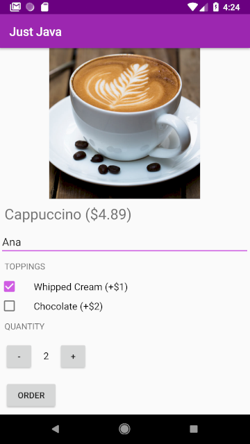
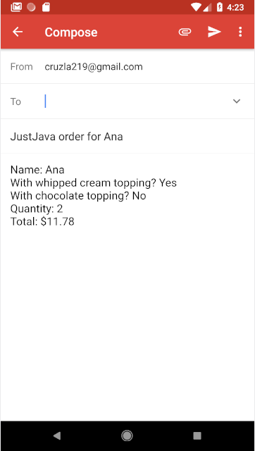

# JustJava
Coffee ordering app for Android Basics Nanodegree (Udacity)

This application simulates a coffee order form. When the order button is pressed, the app opens an email intent with the order summary.

